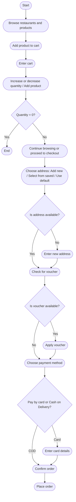
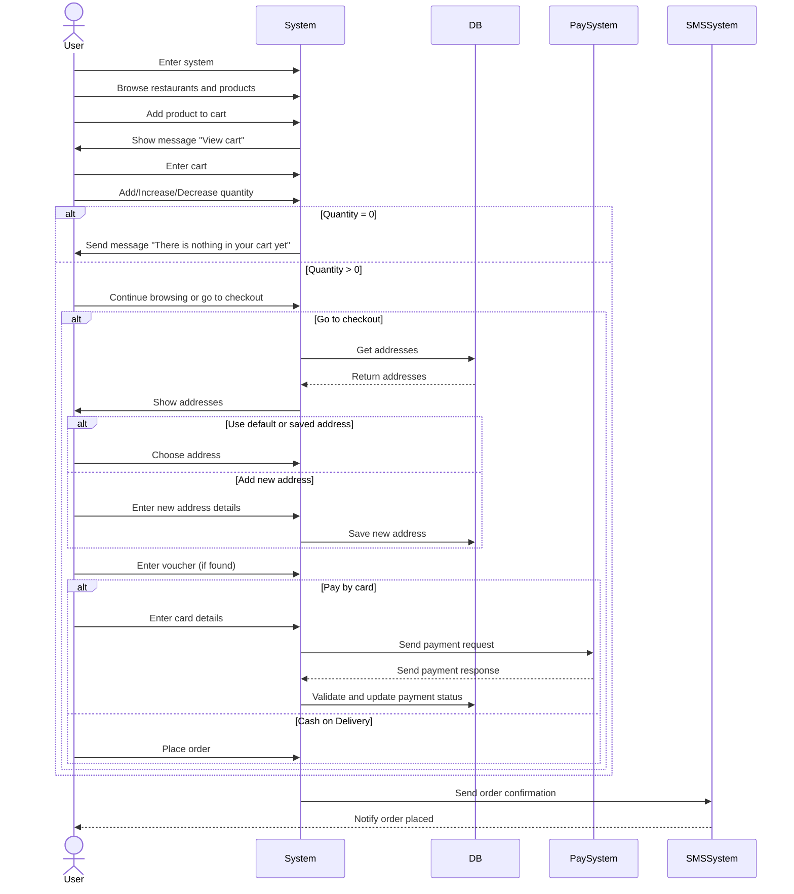

# Food Delivery System

## 📌 About The Project

The **Food Delivery System** is a scalable, secure, and feature-rich platform designed to manage the complete food ordering lifecycle — from restaurant discovery to payment settlement and analytics.

The system supports **multi-restaurants**, **multiple payment methods**, **real-time order tracking**, and **advanced analytics dashboards** for both the platform and restaurants.

It is built to be:

-  Multi-country & multi-language ready
-  High performance & scalable
-  Secure with full payment auditing
-  Data-driven with detailed insights

---

##  System Feature List

Below is a structured overview highlighting all the key features available in the platform

---

# 👤 User Management Features

##  Authentication & Account Management

- **Login**
    
    Users can log in using their phone number or email address.
    
- **Registration**
    
    Create a new user account.
    
- **Password Recovery**
    
    Reset password using OTP verification.
    
- **Change Password**
    
    Update the current password securely.
    

---

##  User Profile & Settings

- **View Profile**
    
    View personal profile information.
    
- **Edit Profile**
    - Edit Email
    - Edit First Name
    - Edit Last Name
    - Edit Phone Number

---

##  Address Management

- **Add Address**
    
    Save a new delivery address.
    
- **Edit Address**
    
    Update an existing address.
    
- **Delete Address**
    
    Remove an address.
    
- **Set Default Address**
    
    Select a default address for orders.
    

---

# 🔍 Discovery & Browsing Features

##  Restaurant & Food Browsing

- **Browse Restaurants by Category**
    
    Discover restaurants by food category (Burger, Pizza, etc.).
    
- **Browse Restaurant Menu**
    
    View restaurant menus.
    
- **Browse Product Details**
    
    View detailed dish information.
    

---

##  Ratings & Recommendations

- **Top-Rated Restaurants**
    
    Discover restaurants with the highest ratings.
    
- **Top-Rated Dishes**
    
    View the most popular and highly rated dishes.
    

---

##  Sorting & Filtering

Restaurants can be sorted by:

- Recommendations
- Alphabetical Order (A–Z)
- High Rating
- Fast Delivery
- Nearest Location (Based on user location)

---

##  Search

- **Search Restaurants**
    
    Search by restaurant name or category.
    
- **Search Food Items**
    
    Search for specific dishes.
    

---

##  Nearby Restaurants

- Detect and display restaurants closest to the user using geolocation data.

---

# 🛒 Cart Management

- Add products to cart
- Apply discount / voucher codes
- Edit cart contents
- Increase or decrease product quantity
- View cart details
- Remove specific items
- Clear the entire cart

---

# 📦 Order Management

- **Place Order**
    
    Submit an order successfully.
    
- **Cancel Order**
    
    Cancel orders by customer or restaurant.
    
- **Real-Time Order Tracking**
    - Pending
    - Preparing
    - Out for Delivery
    - Delivered
- **Notifications**
    
    Instant updates when order status changes.
    
- **Order History**
    
    View completed, canceled, or failed orders.
    
- **Detailed Order View**
    
    Full order breakdown and timeline.
    
- **Automated Confirmation**
    
    Email or SMS confirmation after order placement.
    
- **Payment Options**
    - Cash on Delivery (COD)
    - Online Payment
    - Wallet Payment

---

# 💳 Payment & Wallet System

> Not just a payment gateway — a full financial ecosystem
> 

##  Payment Integration

- Initiate payments via payment API
- Verify completed payments
- Process refunds

---

##  Payment Verification & Validation

- Validate Transaction ID (non-duplicate)
- Verify paid amount matches order amount
- Confirm correct Order ID

---

##  Multiple Payment Methods

- Credit Cards
- Debit Cards
- Digital Wallets
- Cash on Delivery (COD)

---

##  Transaction Management

- **Restaurant Dashboard**
    - View successful, failed, and refunded transactions
- **System Dashboard**
    - Global view of all platform transactions

---

##  Real-Time Payment Status

- Pending
- Completed
- Failed
- Refunded
- Voided

---

##  Digital Receipts

- Automatically generate digital receipts for every successful transaction.

---

##  Security & Error Handling

- Server-side transaction validation
- Secure data handling
- User-friendly error messages

---

##  Auditing & Logging

- Full request & response logging
- Timestamped payment lifecycle records
- Used for debugging and dispute resolution

---

##  Financial Auditing

- Revenue reconciliation
- Vendor payouts calculation
- Platform commission tracking

---

# 🎁 Offers & Promotions

- **Voucher Codes**
    
    Apply promo codes during checkout.
    
- **Restaurant Offers**
    
    Deals like *Buy 1 Get 1* or special discounts.
    

---

# 📊 Analytics & Dashboard (System)

##  Platform Statistics

- Total Restaurants Count
- Total Customers Count
- Active Customers Count
- Daily Orders Count
- Total Orders Count
- Daily Cancelled Orders
- Total Cancelled Orders

---

##  Financial Metrics

- Daily Transactions Amount
- Total Transactions Amount
- Daily Financial Report
- Monthly Financial Report

---

# 🏪 Analytics & Dashboard (Restaurant)

##  Order Analytics

- Daily Orders Count
- Daily Undelivered Orders
- Total Orders Count
- Daily Cancelled Orders
- Total Cancelled Orders

---

##  Financial Analytics

- Daily Sales Amount
- Total Sales Amount

---

##  Reports & Insights

### Daily Transactions Report

Includes:

- Total orders
- Successful & canceled orders
- Total revenue
- Platform commission
- Net payout for restaurant

### Monthly Transactions Report

Helps restaurants with:

- Accounting
- Performance analysis
- Revenue tracking

---

##  Localization & Regional Settings

Designed to support users across different regions and cultures.

- **Multi-Language Support**
    
    The platform allows users to seamlessly switch between multiple languages such as English, Arabic, and more.
    
- **Multi-Region & Currency Support**
    
    Supports multiple countries with localized currencies, formats, and regional settings.
    
- **Smart Region Detection**
    
    Automatically detects the user’s location using IP address or GPS data on first launch to deliver localized content, pricing, and currency.

---
# 📝 USE CASE: PLACE ORDER

##  FLOW CHART



##  Sequence Diagram



##  Pseudocode

```js 
FUNCTION PlaceOrder(user_id, cart_id, payment_method, address_id, voucher_code):

    // 1. User enters system
    // Actor: User
    DISPLAY "Welcome to Food App"

    // 2. User browsing
    // Actor: User
    products = System.BrowseRestaurantsAndProducts()
    UserAddsToCart(cart_id, products)

    // 3. System shows cart message
    // Actor: System
    System.ShowMessage("View cart")

    // 4. User enters cart and modifies quantity
    // Actor: User
    cart_items = System.GetCartItems(cart_id)
    UserModifyQuantity(cart_items)

    IF CartIsEmpty(cart_items):
        // Actor: System
        System.ShowMessage("There is nothing in your cart yet")
        RETURN Error("Cart empty")
    ELSE:
        UserChoosesNextAction = GetUserChoice("Continue browsing / Checkout")
        IF UserChoosesNextAction == "Checkout":

            // 5. Address handling
            // Actor: System & DB
            addresses = DB.GetAddresses(user_id)
            chosen_address = UserChooseAddress(addresses)

            IF chosen_address == "New Address":
                new_address = UserEnterAddressDetails()
                DB.SaveAddress(user_id, new_address)
                chosen_address = new_address

            // 6. Voucher
            voucher = UserEnterVoucher(voucher_code)
            IF voucher != None:
                System.ApplyVoucher(voucher)

            // 7. Payment Processing
            IF payment_method == "Card":
                card_details = UserEnterCardDetails()
                TRY:
                    payment_response = PaySystem.ProcessPayment(card_details, cart_items.total)
                    System.ValidatePayment(payment_response)
                    DB.UpdatePaymentStatus(cart_id, payment_response.status)
                CATCH Exception:
                    RETURN Error("Payment failed")
            ELSE IF payment_method == "Cash":
                System.PlaceOrder(cart_id, chosen_address, payment_method)

            // 8. Notification
            System.SendNotification("Order confirmed", user_id)
            SMSSystem.SendSMS("Order placed successfully", user_id)

    RETURN Success("Order completed")
END FUNCTION

```
# 🧩 Entity Relationships

###  Entities

* **User**
* **Cart**
* **CartItem**
* **Order**
* **OrderItem**
* **Product**
* **Address**
* **Payment**
* **Voucher**

---

###  Relationships

* **Customer → Order**

  * Customer has many Orders
  * Order belongs to Customer

* **Customer → Cart**

  * Customer has one Cart
  * Cart belongs to Customer

* **Customer → Address**

  * Customer has many Addresses
  * Address belongs to Customer

* **Cart → CartItem**

  * Cart has many CartItems
  * CartItem belongs to Cart

* **CartItem → Product**

  * CartItem belongs to Product
  * Product has many CartItems

* **Order → OrderItem**

  * Order has many OrderItems
  * OrderItem belongs to Order

* **OrderItem → Product**

  * OrderItem belongs to Product
  * Product has many OrderItems

* **Order → Payment**

  * Order has one Payment
  * Payment belongs to Order

* **Voucher → User**

  * Voucher can be used by many Users
  * User can use many Vouchers *(logical usage, not ownership)*

